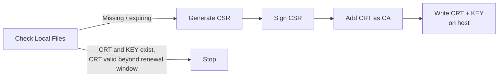

# Description

This role helps generate certificates from HashiCorp Vault PKI.

# Usage

This role generates 3 resources:

- PKI Role
- Certificate Authority
- Leaf Certificate

And saves the PEM and private key contents on filesystem.

The CA and leaf certificate private keys are stored Vault PKI. CA is created as `internal` type instead of `exported` which is the safest option
The leaf certificate private key

# Configuration

```yaml
cert_name: 'XYZ App'
cert_domain_sans: ['dev-xyz.example.org']
cert_ip_sans:     ['192.168.1.1']
cert_ca_ttl: '365d'
cert_pem_path:         '/certs/xyz-app-ca.crt'
cert_private_key_path: '/certs/xyz-app-ca.key'
cert_renew_before: '+30d'

# Role, CA, and Leaf Cert Info
cert_info:
  organization: 'XYZ Org'
  unit:         'XYZ Unit'
  country:      'XYZ County'

# Adjust PKI Role Permissions
cert_role_allow_bare_domain: true
cert_role_allow_subdomains:  true
cert_role_allow_any_name:    true
cert_role_max_ttl:           '365d'

# You can also allow exporting CA private key.
# WARNING: Not recommended unless absolutely necessary.
cert_ca_type: 'exported'
```

# Details

### Process



## Generate Client certificate

### Process

```
+----------------+   Optional   +-------------------+   Missing/expiring   +--------------+          +-----------------+
|                |------------->| Check Local CA    |--------------------->| Generate CA  |--------->| Write CA CRT+KEY |
| Leaf Cert Run  |              |                   |                      |              |          |                 |
+----------------+              +-------------------+                      +--------------+          +-----------------+
        |
        v
+-------------------+   Missing/expiring   +-------------+        +--------------+          +-----------------+
|                   |--------------------->| Create Role |------->| Generate CRT |--------->| Write CRT + KEY |
| Check Leaf Files  |                      |             |        |              |          |    on host      |
|                   |                      |             |        |              |          |                 |
+-------------------+                      +-------------+        +--------------+          +-----------------+
           |
           | CRT and KEY exist, CRT valid beyond renewal window
           v
         Stop
```

### Configuration

```yaml
cert_certificate_path: '/certs/application.crt'
cert_private_key_path: '/certs/application.key'
cert_renew_before: '+30d'

# Optional: also ensure Application CA during same role run
cert_ensure_ca: true
cert_ca_common_name: 'application-ca'
cert_ca_certificate_path: '/certs/application-ca.crt'
cert_ca_private_key_path: '/certs/application-ca.key'
cert_ca_issuer_name: 'Application'
cert_ca_info:
  organization: 'Org'
  unit:         'Unit'
  country:      'County'
cert_ca_ttl: '365d'


# Role Configuration
cert_role: 'application-role'
cert_role_issuer_name: 'Application'
cert_role_info:
  organization: 'Org'
  unit:         'Unit'
  country:      'County'
cert_role_max_ttl: '365d'
cert_role_allow_domains: 'example.org'
cert_role_allow_subdomains: True
```
