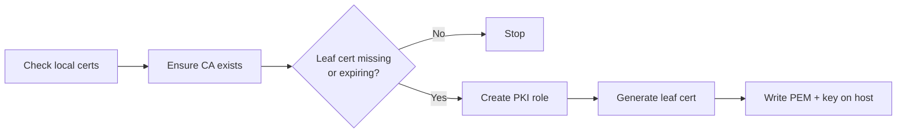

# Description

This role generates certificates from HashiCorp Vault PKI(Public Key Infrastructure) module.

# Details

The process involves generating 5 resources:

- __Certificate Authority (CA)__ — Trusted entity that owns signing key and signs certificates.
- __Certificate Issuer__ — Vault object representing CA certificate and associated signing key.
- __Certificate CSR__ — Request containing public key and identity details to be signed.
- __PKI Role__ — Policy controlling allowed names, SANs, TTLs, and certificate usage.
- __Leaf Certificate__ — End certificate issued to server, client, node, or service.

The CA and leaf certificate private keys are stored Vault PKI. CA is created as `internal` type by default instead of `exported` since storing CA private key outside of Vault is unsafe.

The leaf certificate private key and PEM file are saved in specified location together with CA PEM.



# Configuration

```yaml
vault_pki_ca_key_name:    'xyz.example.org-ca'
vault_pki_ca_common_name: 'xyz.example.org CA'
vault_pki_role_name:      'xyz.example.org-role'
vault_pki_common_name:    '{{ hostname }}.wg'
vault_pki_store_path:     '/data/xyz-app/certs'
vault_pki_domain_sans:    ['dev-xyz.example.org']
vault_pki_ip_sans:        ['{{ ansible_local.wireguard.address }}']

# Role, CA & Cert Info
vault_pki_info:
  organization: 'XYZ Org'
  unit:         'XYZ Unit'
  country:      'XYZ County'

# Adjust PKI Role Permissions
vault_pki_role_allow_bare_domain: true
vault_pki_role_allow_subdomains:  true
vault_pki_role_allow_any_name:    true
vault_pki_role_max_ttl:           '365d'

# Set file permissions
vault_pki_user: 'dockremap'
vault_pki_group: 'docker'
vault_pki_pem_mode: '0644'
```

You can also allow exporting CA private key.
```yaml
# WARNING: Not recommended unless absolutely necessary.
vault_pki_ca_type: 'exported'
```
